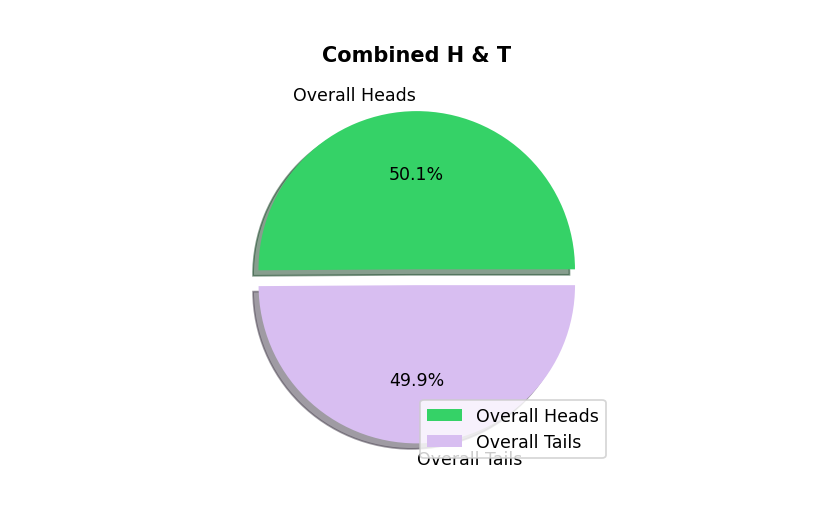
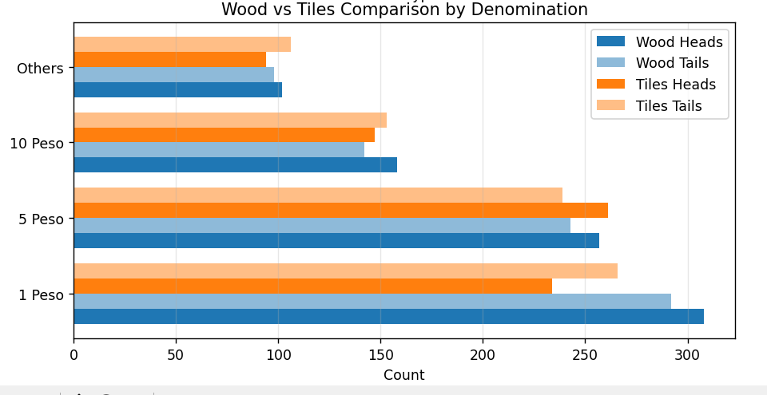
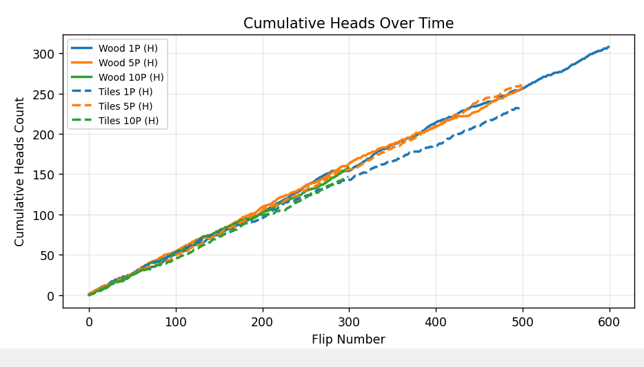

  

  

<h2>Plot 1: Stacked Bar Chart — Coin Flips: Heads vs Tails</h2>

<h3>Purpose:</h3>

This plot compares the total number of heads and tails between old coins and new coins, broken down by denomination.

<h3>How it works:</h3>
<ul>
<li>There are two main categories:
    <ul>
        <li>Old Coin</li>
        <li>New Coin</li>
    </ul>
</li>

<li>Each category has two stacked bars:
    <ul>
        <li>Left bar = Heads</li>
        <li>Right bar = Tails (lighter color)</li>
    </ul>
</li>

<li>Each bar is stacked into denominations:
    <ul>
        <li>1 Peso</li>
        <li>5 Peso</li>
        <li>10 Peso</li>
        <li>Others</li>
    </ul>
</li>
</ul>

<h3>What it shows:</h3>
<ul>
<li>The total height of each stacked bar represents the total number of flips.</li>
<li>The colored segments show how much each denomination contributed.</li>
<li>Heads and tails counts are very close, indicating a fair coin toss simulation.</li>
</ul>

<h3>Interpretation:</h3>

Since heads and tails totals are nearly equal, this supports the probability theory that:

P(Heads) ≈ 0.5 &nbsp;&nbsp;&nbsp; and &nbsp;&nbsp;&nbsp; P(Tails) ≈ 0.5

  

<h2>Plot 2: Pie Chart — Combined Heads and Tails</h2>

<h3>Purpose:</h3>

This plot shows the overall percentage of heads and tails from all 15 groups combined.

<h3>How it works:</h3>

Uses total counts calculated by:

<pre><code>full_heads = total_flip_result(..., heads=True)
full_tails = total_flip_result(..., tails=True)
</code></pre>

Displays percentage of heads and tails.

<h3>What it shows:</h3>

Example result:

<ul>
<li>Heads: 50.1%</li>
<li>Tails: 49.9%</li>
</ul>

<h3>Interpretation:</h3>

This confirms that the coin toss simulation behaves like a fair random process.

The closer the result is to 50%–50%, the more it follows theoretical probability.

  

<h2>Plot 3: Horizontal Bar Chart — Wood vs Tiles Comparison</h2>

<h3>Purpose:</h3>

This compares heads and tails counts between:

<ul>
<li>Wood coins (Old coins)</li>
<li>Tile coins (New coins)</li>
</ul>

for each denomination.

<h3>How it works:</h3>

For each denomination:

<ul>
<li>Wood Heads</li>
<li>Wood Tails</li>
<li>Tiles Heads</li>
<li>Tiles Tails</li>
</ul>

are shown side by side.

<h3>What it shows:</h3>

<ul>
<li>Comparison of old vs new coin fairness</li>
<li>Comparison of heads vs tails balance per denomination</li>
</ul>

<h3>Interpretation:</h3>

If wood and tile coins have similar heads/tails counts, both coin types behave fairly.

No significant bias is observed.

  

<h2>Plot 4: Line Chart — Cumulative Heads Over Time</h2>

<h3>Purpose:</h3>

This shows how the number of heads increases over time as more flips occur.

<h3>How it works:</h3>

Uses cumulative sum:

<pre><code>np.cumsum(...)
</code></pre>

Each line represents a coin type and denomination.

<ul>
<li>Solid lines = Wood coins</li>
<li>Dashed lines = Tile coins</li>
</ul>

<h3>What it shows:</h3>

<ul>
<li>The number of heads increases steadily over flips</li>
<li>The lines appear approximately linear</li>
</ul>

<h3>Interpretation:</h3>

This demonstrates the <b>Law of Large Numbers</b>.

As the number of flips increases, the observed results approach expected probability.

The steady growth confirms randomness without bias.

<h2>Explanation of Key Functions in the Code</h2>

<h3>total_flip_result()</h3>

<b>Purpose:</b> 
Calculates total heads or tails across all 15 groups.

Uses:

<pre><code>.iloc[-1]
</code></pre>

This gets the final cumulative count.

<h3>result_per_coin()</h3>

<b>Purpose:</b> 
Adds flip counts from multiple groups.

Example:

<pre><code>new1_heads = result_per_coin(df1, df2, df3)
</code></pre>

<h3>concat_df()</h3>

<b>Purpose:</b> 
Combines multiple flip series and computes cumulative heads or tails over time.

Uses:

<pre><code>np.cumsum()
</code></pre>

This produces the cumulative line plot.

<h2>Overall Interpretation of the Experiment</h2>

<ul>
<li>Heads and tails occur with nearly equal probability</li>
<li>Old coins and new coins behave similarly</li>
<li>Different denominations show no significant bias</li>
<li>Results follow expected probability theory</li>
</ul>

This confirms that the coin toss simulation produces fair and random outcomes.

<h2>Scientific Conclusion</h2>

The results of the coin toss simulation across 15 groups confirm that the probability of obtaining heads or tails is approximately equal. All visualizations, including stacked bar charts, pie charts, comparison charts, and cumulative line plots, support the theoretical expectation of a fair coin. As the number of flips increases, the observed outcomes converge toward a 50/50 distribution, demonstrating the Law of Large Numbers. No significant bias was observed between old and new coins or between different denominations.

